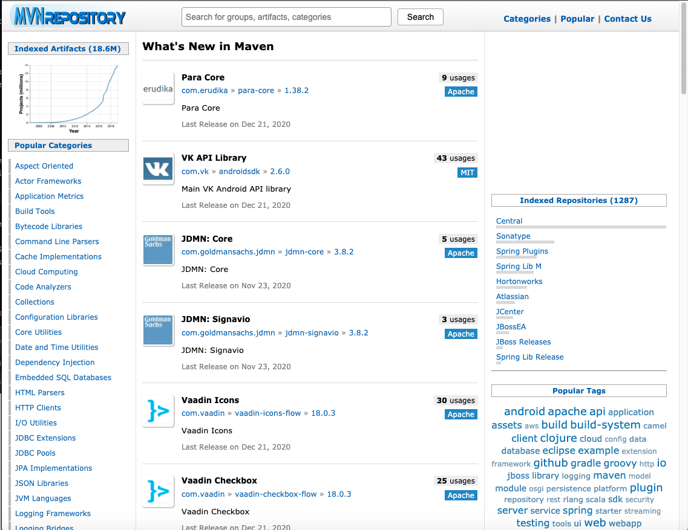
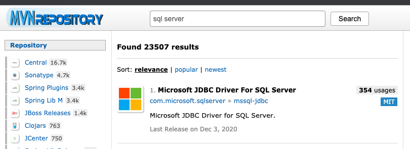
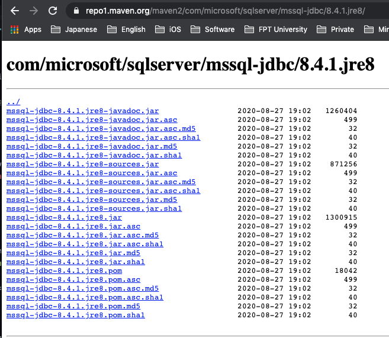
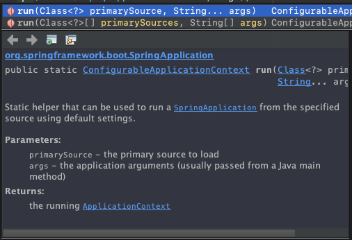

# GraphQL-kickstater-springboot-tutorial

<h1 align="center"> Add additional dependencies </h1>  

In this tutorial. We are going to show you how to integrate dependencies (libraries) into your own Maven project.
<!-- TABLE OF CONTENTS -->
<details open="open">
  <summary><h2 style="display: inline-block">Table of Contents</h2></summary>
  <ol>
    <li><a href="#step-1">What is Maven Dependency ?</a></li>
    <li><a href="#step-2">How and where to get the Maven dependencies integrated in our project ?</a></li>
    <li><a href="#step-3">Introduction to Jackson JSON Parser</a></li>
    <li><a href="#step-4">Introduction to GraphQL Spring Boot Kickstart</a></li>
  </ol>
</details>

## Let's begin

####  What is Maven Dependency ?
Before getting started with Maven Dependency, we need to know what a <i>pom.xml</i> file is.
Every Maven project always has a <i>pom.xml</i> that defines what and how our project should do.

The figure below illustrates the definition of a <i>pom.xml</i> file when we open it.

This XML file contains the XSD link in the <b>project</b> tag which is XML Schema that will check the whether the XML is well-formed and validated or not.


The below XML snippet which is actually from the generation process when we did from the step 1 and taken from the <b>pom.xml</b> file.
```xml
	<groupId>com.bangmaple</groupId>
	<artifactId>demo-sb-graphql</artifactId>
	<version>0.0.1-SNAPSHOT</version>
	<name>demo-sb-graphql</name>
	<description>GraphQL with SpringBoot kickstart</description>
```

This XML snippet defined the version of Java we are using.
```xml
	<properties>
		<java.version>1.8</java.version>
	</properties>
```

In the <b>dependencies</b> tag, we can include the dependencies as we often call dependencies as <i>libraries</i> in normal Java project. For example: <i>Apache Ant build tool</i>
```xml
	<dependencies>
		<dependency>
			<groupId>org.springframework.boot</groupId>
			<artifactId>spring-boot-starter-data-jpa</artifactId>
		</dependency>
        ...
	</dependencies>
```

Look inside the <b>dependency</b> tag we have the <i>groupId, artifactId, version, scope, ...</i>.
If you are new to <b>Apache Maven</b>, you can download dependencies (libraries) from the <b>Maven Repository</b> just like how we download apps from the Google Play Store/App Store:



- Go to <a href="https://mvnrepository.com">Maven Repository</a>

- Search for a dependency. For example, I want to integrate/download the <b>Microsoft JDBC Driver For SQL Server</b>

- Select the corresponding version of the dependency and the version of Java of the project you are dealing with. For example, I select <b>8.4.1.jre8</b>.

- If I want to integrate this dependency into my project. I will need to copy the XML snippet from the text area.
```xml
<!-- https://mvnrepository.com/artifact/com.microsoft.sqlserver/mssql-jdbc -->
...
	<dependencies>
        ...
        <dependency>
            <groupId>com.microsoft.sqlserver</groupId>
            <artifactId>mssql-jdbc</artifactId>
            <version>8.4.1.jre8</version>
        </dependency>
        ...
</dependencies>
```
- Paste the clipboard into the <b>dependencies</b> tag of the <b>pom.xml</b>.
##### Please take note that this is just an example of how to integrate dependency into your Maven project. Please remove this dependency from the pom.xml file after finishing this step to avoid the further problem.

- If you are using other build tool like <b>Apache Ant</b> you will need to download the dependency as <i>jar</i> file(s).


Save it to the suitable path where you can find easily.


By clicking the <a href="https://repo1.maven.org/maven2/com/microsoft/sqlserver/mssql-jdbc/8.4.1.jre8">View all</a> label. You will be redirected to the site where contains many files you may need further.


We need to take a look at the name <strong>-javadoc.jar</strong> and <strong>-source.jar</strong>.

- The <b>javadoc</b> jar file contains the description of the class, variable, function definition you may need to know.




- The <b>source</b> jar file contains the source code of the dependency which can show us how that class or function behave.


In NetBeans IDE, we can see whether the dependency contains <i>downloaded dependency</i>, <i>javadoc</i>, <i>source</i>. You can download those just by right-clicking to that dependency of the current Maven project.


#### Thank you

Thanks for watching the tutorial from the beginning to the end.
If you are facing any issue, don't hesitate to create a new <b>Issue</b>.